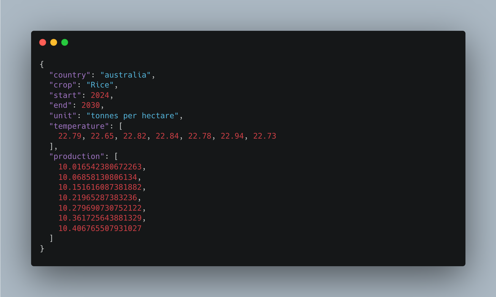

<h1 align="center" id="title">fcs-server-py</h1>

- flask based webserver project which uses ML's Linear Regression model to predict the crop production of different countries.
- it uses [this dataset](https://climateknowledgeportal.worldbank.org/download-data) for observed and predicted temperature and this for [crop production](https://docs.google.com/spreadsheets/d/1qPP5FzFYa5JpMEu8WhVvxF2-kvKqf_0Qg7zEU55pdf0/edit?usp=sharing). 
- server link: https://fcs-server-py.onrender.com/

---

### Project Screenshots

1. Seaborn graph for China's wheat dataset - training and testing
2. Seaborn graph for China's wheat crop prediction till 2040
3. json data from server




---  
  
### 🧐 Features
- Crop Prediction of different countries - India, Australia and China
- Temperature Prediction for each country

---

### 🛠️ Installation Steps
```sh
# building the project
pip freeze > requirements.txt
vim build.sh
> #!/usr/bin/env bash
> # exit on error
> set -o errexit

> pip install --upgrade pip
> pip install wheel
> pip install -r requirements.txt


# to run the project locally
pip3 install wheel
pip3 install -r requirements.txt
flask run   # or, python3 app.py
````


---


### 💻 Technologies Used
- runtime/ framework: python, flask
- dependencies: seaborn, pandas, numpy, sklearn, matplotlib, etc.
